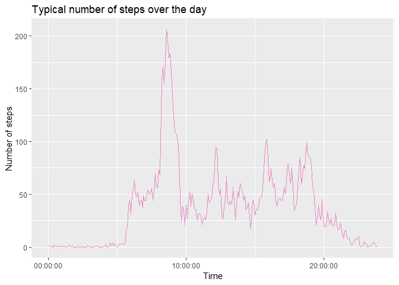

## Loading and preprocessing the data
First, the package required for this analysis are loaded.


```r
require(dplyr)
```

```
## Loading required package: dplyr
```

```
## 
## Attaching package: 'dplyr'
```

```
## The following objects are masked from 'package:stats':
## 
##     filter, lag
```

```
## The following objects are masked from 'package:base':
## 
##     intersect, setdiff, setequal, union
```

```r
require(ggplot2)
```

```
## Loading required package: ggplot2
```

```r
require(RColorBrewer)
```

```
## Loading required package: RColorBrewer
```

```r
require(hms)
```

```
## Loading required package: hms
```

This assignment uses the [Activity monitoring data](https://d396qusza40orc.cloudfront.net/repdata%2Fdata%2Factivity.zip). After making sure the file was downloaded and is present in the working directory, the following code loads the data into R.


```r
if (!exists("activity.csv")){
    unzip("activity.zip")
}
data <- tbl_df(read.csv("activity.csv", header = TRUE))
```


## What is mean total number of steps taken per day?
The observations are grouped by date and the distribution of number of steps taken per day is computed along with the mean and median of this daily number of steps.


```r
stepsPerDay <- data %>% 
    group_by(date) %>% 
    summarize(totalSteps = sum(steps, na.rm = TRUE))
meanSteps <- mean(stepsPerDay$totalSteps)
medianSteps <- median(stepsPerDay$totalSteps)
```

The results are then plotted as follows:


```r
colors <- brewer.pal(5, "Set2")
p1 <- ggplot(data = stepsPerDay, aes(x = totalSteps)) + 
    geom_histogram(na.rm = TRUE, fill = colors[1], color = 1, bins = 10) + 
    labs(title = "Distribution of the number of steps taken per day") +
    labs(x = "Number of steps") + 
    labs(y = "Count") +
    geom_vline(xintercept = c(meanSteps, medianSteps), color = colors[2:3], lwd = c(2,2)) + 
    annotate("text", x = c(meanSteps-2000, medianSteps+2000), y = c(16, 16), label = c("Mean", "Median"), color = colors[2:3], size = 8)
print(p1)
```

<!-- -->

As shown on the above histogram the __mean__ and __median__ number of steps taken per day are __9354__ and __10395__ respectively.

## What is the average daily activity pattern?

A typical step pattern for a day can computed and plotted with the following code:


```r
stepsPerInterval <- data %>% 
    group_by(interval) %>% 
    summarize(meanSteps = mean(steps, na.rm = TRUE), 
              time = sample(hms(hour = interval %/% 100, 
                                minute = interval %% 100), 
                            1))
p2 <- ggplot(data = stepsPerInterval, aes(x = time, y = meanSteps)) + 
    geom_line(color = colors[4]) + 
    labs(title = "Typical number of steps over the day") +
    labs(x = "Time") + 
    labs(y = "Number of steps")
print(p2)
```

<!-- -->

```r
maxSteps <- as.character(round(max(stepsPerInterval$meanSteps)))
bestStartTime <- as.character(stepsPerInterval$time[which.max(stepsPerInterval$meanSteps)-1])
bestEndTime <- as.character(stepsPerInterval$time[which.max(stepsPerInterval$meanSteps)])
```

On average, the 5-minutes interval during which people take the more steps is between __08:30:00__ and __08:35:00__ where __206__ are taken.

## Imputing missing values

In this dataset __2304__ observations have missing values. That is, 2304 observations are not fully characterized. This represents 13.11% of the observations. 

Since this value is relatively important, we suggest to fill these missing values with the average number of steps for the current time interval over the other days. 


```r
imputedData <- data
for(row in seq_len(dim(data)[1])) {
    if(is.na(data$steps[row])) {
        imputedData$steps[row] <- mean(data$steps[data$interval == data$interval[row]], na.rm = TRUE)
    }
}
```

Now that the missing values were imputed, we can plot again the distribution of number of steps taken per day and compare it with the one we had obtained before removing the missing values.


```r
stepsPerDay <- imputedData %>% 
    group_by(date) %>% 
    summarize(totalSteps = sum(steps, na.rm = TRUE))
meanSteps <- mean(stepsPerDay$totalSteps)
medianSteps <- median(stepsPerDay$totalSteps)

colors <- brewer.pal(5, "Set2")
p3 <- ggplot(data = stepsPerDay, aes(x = totalSteps)) + 
    geom_histogram(na.rm = TRUE, fill = colors[1], color = 1, bins = 10) + 
    labs(title = "Distribution of the number of steps taken per day") +
    labs(x = "Number of steps") + 
    labs(y = "Count") +
    geom_vline(xintercept = c(meanSteps, medianSteps), color = colors[2:3], lwd = c(2,2)) + 
    annotate("text", x = c(meanSteps-2000, medianSteps+2000), y = c(16, 16), label = c("Mean", "Median"), color = colors[2:3], size = 8)
print(p3)
```

<!-- -->

The __mean__ and __median__ number of steps taken per day are __10766__ and __10766__ respectively.

We notice here that this distribution is more gathered aroung the mean which makes perfect sense since all the previously missing values were imputed as being the mean of the existing values which therefore increases the number of observations around the mean.

## Are there differences in activity patterns between weekdays and weekends?

To answer this question, we will start by classifying days betweend weekdays and weekend day.


```r
Sys.setlocale("LC_TIME", "English")
```

```
## [1] "English_United States.1252"
```

```r
stepsPerInterval <- imputedData %>% 
    mutate(dayType = ifelse(weekdays(as.Date(as.character(date))) %in% c("Saturday", "Sunday"), "weekend", "weekday")) %>% 
    group_by(interval, dayType) %>% 
    summarize(meanSteps = mean(steps, na.rm = TRUE), 
              time = sample(hms(hour = interval %/% 100, 
                                minute = interval %% 100), 
                            1))


colors <- brewer.pal(5, "Set2")
p4 <- ggplot(data = stepsPerInterval, aes(x = time, y = meanSteps)) + 
    geom_line(color = colors[4]) + 
    facet_grid(rows = vars(dayType)) +
    labs(title = "Comparison betwee number of steps during weekdays and weekends") +
    labs(x = "Time") + 
    labs(y = "Number of steps")
print(p4)
```

<!-- -->
